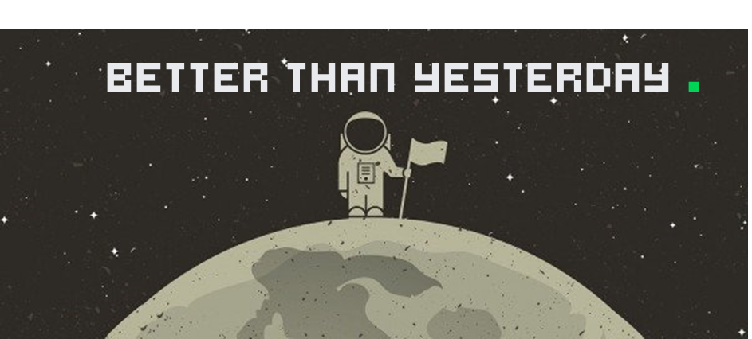

<p align="center">
  
</p>

> 👨‍🚀 **Repo for the purpose of personal study**

<p align="center">
  

  

  
</p>

# 🌐 Proposed challenge

Write test suites applying the TDD methodology using **Vitest** with Typescript.

# 🚀 Technologies

This code source was developed with the following technologies:

### ⚛️ Main Techs

- [Node.js](https://nodejs.org/en/)
- [Typescript](https://www.typescriptlang.org/)
- [Vitest](https://vitest.dev/)

### 📚 Libs & Dependencys

- [Eslint](https://eslint.org/)
- [Date-fns](https://date-fns.org/)

### 🐱‍👤 Techniques

- [TDD](https://en.wikipedia.org/wiki/Test-driven_development)

## :information_source: How To Use

To clone and run this application, you'll need [Git](https://git-scm.com), [Node.js v14.16][nodejs] or higher + [NPM v8][npm] or higher installed on your computer. From your command line:

```bash
# Clone this repository
$ git clone https://github.com/felipeAguiarCode/node-ts-tdd-with-vitest-study

# Go into the repository
$ cd node-ts-tdd-with-vitest-study

# Install dependencies
$ npm install

# Run the tests
$ npm run test
```
